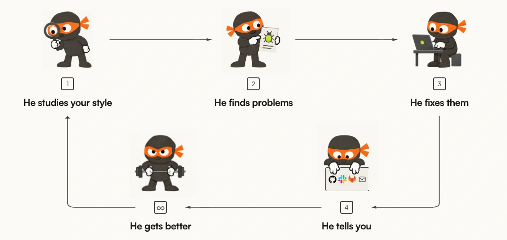
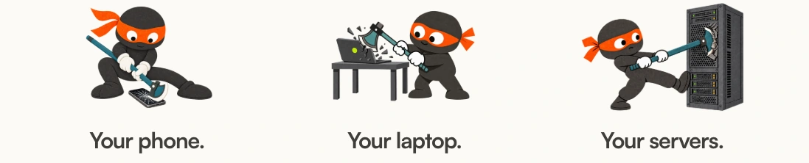

<p align="center">
  <a href="https://0.security/">
    
  </a>
</p>

<p align="center">
  <picture>
    <source media="(prefers-color-scheme: dark)" srcset="assets/0sec-aperture-white.svg">
    
  </picture>
</p>

<p align="center">
  <strong>Open-source cybersecurity research and tooling.</strong>
</p>


<p align="center">
  <a href="https://0.security/"><strong>0.security</strong></a><br/>
  <sub>Research preview</sub>
</p>

<p align="center">
  <a href="https://0.security"></a>
  <a href="https://docs.0.security/"></a>
  <a href="https://github.com/0sec-labs/foxguard"></a>
</p>

<p align="center">
  <a href="LICENSE"></a>
  <a href="https://github.com/0sec-labs/0sec/releases/latest"></a>
  <a href="#research-preview"></a>
</p>

## How it works

<p align="center">
  
</p>


1. **Study.** Read the repository and its conventions. Check retained notes against the current source.
2. **Find.** Investigate code and authorized targets. Reproduce findings with the checks supported by each workflow.
3. **Fix.** Propose scoped source fixes and test candidates against an explicit regression command.
4. **Tell.** Review the findings, evidence and proposed changes.
5. **Improve.** Retain revision-aware codebase notes for later research. Tool and harness improvement workflows remain a research preview.

The local CLI runs on demand. Managed recurring work needs separate service
access and configuration. Slack and GitLab delivery are planned.

<p align="center">
  <a href="https://0.security/research/">
    
  </a>
</p>

## Get started

For a supported macOS or Linux terminal, install the standalone release:

```bash
curl -fsSL https://raw.githubusercontent.com/0sec-labs/0sec/main/install.sh | bash
export PATH="$HOME/.0sec/bin:$PATH"
0 console --mode standard
```

Add the `export` line to your shell profile. In the console, use `/connect` to
configure a supported model connection and `/model` to select a model. The
example selects Standard mode explicitly; plain `0` defaults to YOLO.
Approval behavior depends on the launcher and mode; see the
[console guide](https://docs.0.security/console/). No mode grants testing
authorization or provides OS isolation. Only assess systems you own or have
permission to test.

Alternatively, with Node.js 24 or newer:

```bash
npm install -g 0sec-cli
0 --help
```

The npm package remains `0sec-cli`; it installs `0` and the `0sec` alias.
The full interactive interface requires Bun or the standalone release;
Node supports the command-line workflows. See
[installation](https://docs.0.security/getting-started/) for source builds,
containers, experimental Windows support, and platform prerequisites.

## Connect your models

The local harness needs no 0cloud account when you use supported provider
credentials. Configure the provider, model, and runtime deliberately rather
than relying on whichever credentials happen to be present.
[API Keys](https://docs.0.security/api-keys/) covers the available connections.

You can assign different models to different agent roles. Child agents
currently inherit their parent's provider, account, and endpoint: choose
models supported by that route, such as a multi-model gateway catalog.
This is not automatic cross-provider account switching or a claim of optimal
routing. See [role-model configuration](https://docs.0.security/configuration/#multi-model-role-routing).

Hosted inference also leaves tools in your environment. Managed scans and
recurring reviews require separate service access, repository authorization,
and compatible deployment. See [managed integration](https://docs.0.security/ci/github-action/#managed-lifecycle-compatibility)
before automating enrollment or schedule changes.

## Find, verify, and fix

| Task | Entry points |
| --- | --- |
| Source and package analysis | `0 review`, `0 file-review`, `0 deep-review`, `0 audit` |
| Authorized web/API assessment | `0 scan` with an explicit target and scope |
| Evidence and repair | `0 findings`, `0 verify`, `0 fix`, `0 secure` |
| AI and agent evaluation | `0 eval`, `0 agent-assure` |
| Discovery and identity | `0 recon`, `0 identity`, `0 adgraph`, `0 entragraph` |
| Source, kernel, and binary research | `0 hunt`, `0 research`, `0 kernel`, `0 binary` |

For an authorized local checkout, start with source review:

```bash
0 review ./my-repo --runtime api --depth quick --cost-ceiling 5
```

For a repository investigation-and-repair workflow, first review the setup
requirements and approve a meaningful regression command:

```bash
0 secure ./my-repo \
  --test-command "npm test" \
  --state-dir "$HOME/.0sec/secure/my-repo"
```

`secure` investigates, attempts reproduction and repair, runs regression
tests, and independently verifies repairs. Execution is host-local in managed
checkouts, **not a newly provisioned sandbox**. Publication is opt-in and never
merges PRs. Inspect individual repairs, blocked findings, and errors: a
`completed` status is not proof that every finding was fixed. Cost accounting
and ceiling coverage vary by workflow; provider-side limits remain important.
See [scan workflows](https://docs.0.security/scan-workflows/) and
[budget management](https://docs.0.security/budget-management/).

Specialized commands have additional prerequisites. In particular, `0 binary`
delegates to the optional [0verse engine](0verse/README.md); a basic CLI install
does not supply every binary-analysis backend or kernel VM artifact.

## Documentation

- [Getting started](https://docs.0.security/getting-started/): installation, source builds and your first scan.
- [Console](https://docs.0.security/console/) and [scan workflows](https://docs.0.security/scan-workflows/): interactive and command-line use.
- [Commands](https://docs.0.security/commands/) and [configuration](https://docs.0.security/configuration/): reference.
- [Build a Hackstore extension](https://docs.0.security/hackstore/): create a tool, test it locally, and publish it.
- [Integrations and CI](https://docs.0.security/integrations/) · [Troubleshooting](https://docs.0.security/troubleshooting/).

Docs follow the source checkout; use `0 --version` and command-specific
`--help` when comparing an installed release with newly documented features.

## Research preview

Coverage and verification depth vary by workflow. Review the evidence before
treating an issue as confirmed; generated fixes need review and testing.
See [verification](https://docs.0.security/blind-verification/) for limits and prerequisites.

Agent learning, source evolution and executable plugins are also research-preview
workflows. See the [improvement-plane guide](https://docs.0.security/improvement-plane/).

[Benchmarks](https://docs.0.security/benchmark/) distinguish retained aggregate
results from controlled evaluations. Retained attempts and modes must not be
presented as a single-shot or independently established black-box result.

## Contributing

Build instructions and contribution guidelines are in [CONTRIBUTING.md](CONTRIBUTING.md).
Report security issues through [SECURITY.md](SECURITY.md).

## License

[MIT](LICENSE-MIT) OR [Apache-2.0](LICENSE).
