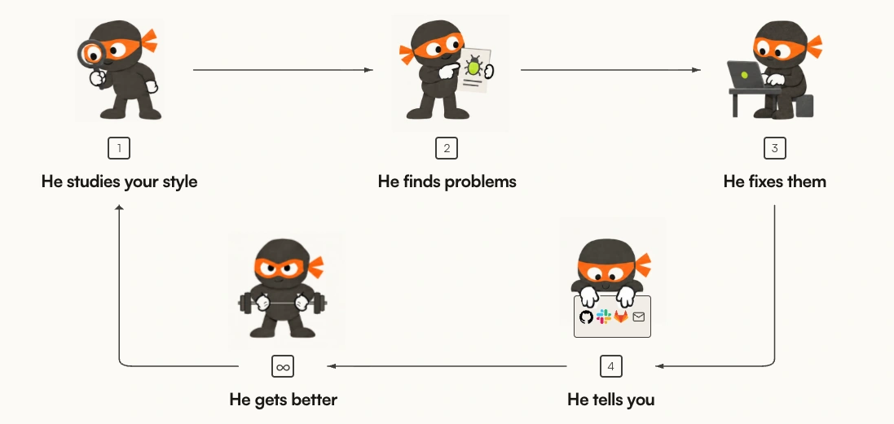

<p align="center">
  <a href="https://0.security/">
    
  </a>
</p>

<p align="center">
  <picture>
    <source media="(prefers-color-scheme: dark)" srcset="assets/0-aperture-white.svg">
    
  </picture>
</p>

<p align="center">
  <strong>The open-source, self-evolving, multi-model harness for security research.</strong><br/>
  <sub>Backed by Y Combinator · The Swiss Applied AI &amp; Cybersecurity Research Lab</sub><br/>
  <a href="https://0.security/">0.security</a> ·
  <a href="https://docs.0.security/">Documentation</a> ·
  <a href="https://github.com/0sec-labs/foxguard">FoxGuard</a>
</p>

<p align="center">
  <a href="LICENSE"></a>
  <a href="https://github.com/0sec-labs/0/releases/latest"></a>
  <a href="#status"></a>
</p>

<p align="center">
  
</p>

## Security research, in your workspace

0 is an open-source, multi-model harness for investigating software security:
read code, run tools, investigate findings and review proposed fixes.
Built by the Swiss Applied AI & Cybersecurity Research Lab, it supports our
[public disclosures and upstream fixes](https://0.security/research/#disclosures).

## Get started

Install on Apple Silicon macOS or x64/ARM64 Linux, then open 0:

```bash
curl -fsSL https://raw.githubusercontent.com/0sec-labs/0/main/install.sh | bash
export PATH="$HOME/.0/bin:$PATH"
0
```


## Work locally, extend deliberately

- Describe an authorized repository and investigation goal in chat, or use
  `0 review ./authorized-repo` for a source review.
- Review findings and proposed changes.
  Follow the [research workflows](https://docs.0.security/research-workflows/)
  for deeper investigations.
- Connect your tools through [MCP and integrations](https://docs.0.security/integrations/).
  Browse `/hackstore`, or [build and locally install an extension](https://docs.0.security/hackstore/).
  Community plugins run as local processes; review them before enabling.

## Why 0?

Use the models you want. Bring the tools you need. Make the workflow your own.
0 brings security investigations and fixes into one terminal workspace, with
focused agents and an extensible toolchain. The harness is open source and
runs under your control.

## Guides

- [Quick start and installation](https://docs.0.security/getting-started/)
- [Models and provider connections](https://docs.0.security/api-keys/)
- [Console, sessions and agents](https://docs.0.security/console/)
- [Plugins and Hackstore publishing](https://docs.0.security/hackstore/)
- [Scope and authorization](https://docs.0.security/scope/)
- [GitHub Actions](https://docs.0.security/ci/github-action/)
- [Troubleshooting](https://docs.0.security/troubleshooting/)

## Status and safety

This is a **research preview**, not a guarantee of coverage or correctness.
Review results and generated fixes before applying them. Tool making and
[evaluated self-improvement](https://docs.0.security/improvement-plane/) are research workflows.

Only test systems you own or are authorized to assess. The optional
[scope plugin](https://docs.0.security/scope/) is disabled by default:
enable it explicitly with `0 plugin enable scope` and configure your boundaries.
The default console uses YOLO mode; use `0 console --mode standard` for

## Contributing and license

Build and extend the harness with [CONTRIBUTING.md](CONTRIBUTING.md).
Report security issues through [SECURITY.md](SECURITY.md).
Licensed under [MIT](LICENSE-MIT) OR [Apache-2.0](LICENSE).

## Acknowledgments

Thanks to the teams behind [OpenTUI](https://github.com/anomalyco/opentui),
[Bun](https://bun.sh/) and [React](https://react.dev/) for the interface stack,
and [Models.dev](https://models.dev/) and [LiteLLM](https://github.com/BerriAI/litellm)
for model metadata and pricing estimates. Thank you to everyone contributing
code, reporting bugs and sharing ideas.
