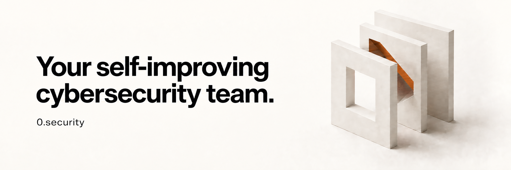
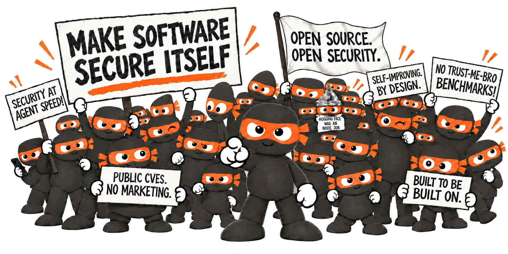
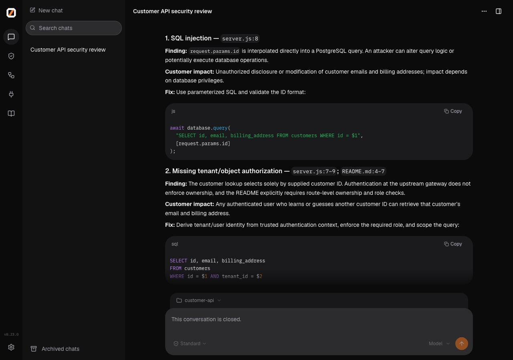
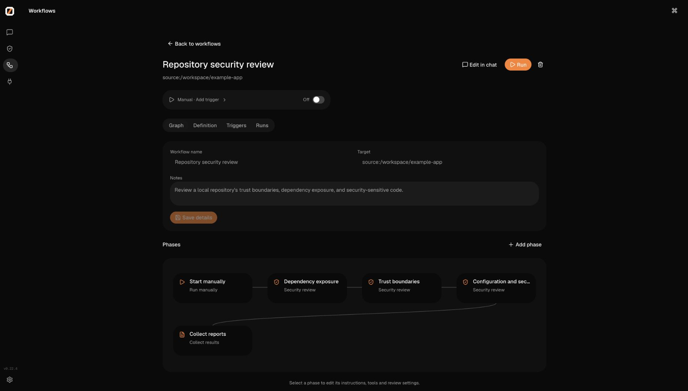

<p align="center">
  <a href="https://0.security/">
    
  </a>
</p>

<p align="center">
  <picture>
    <source media="(prefers-color-scheme: dark)" srcset="assets/0-aperture-white.svg">
    
  </picture>
</p>

<p align="center">
  <strong>Open-source security workflows in your browser, terminal, or coding agent.</strong><br/>
  <sub>Backed by Y Combinator · The Swiss Applied AI &amp; Cybersecurity Research Lab</sub><br/>
  <a href="https://0.security/">0.security</a> ·
  <a href="https://docs.0.security/">Documentation</a> ·
  <a href="https://github.com/0sec-labs/foxguard">FoxGuard</a>
</p>

<p align="center">
  <a href="LICENSE"></a>
  <a href="https://github.com/0sec-labs/0/releases/latest">Latest release</a>
  <a href="#status-and-safety"></a>
</p>

<p align="center">
  
</p>

## Get started

Install on Apple Silicon macOS or x64/ARM64 Linux:

```bash
curl -fsSL https://raw.githubusercontent.com/0sec-labs/0/main/install.sh | bash
export PATH="$HOME/.0/bin:$PATH"
0 web
```

**Command Center (browser):** `0 web` · **Terminal:** `0`

Configure a [model provider](https://docs.0.security/api-keys/) before running AI workflows.

## Workflows

Browser, CLI, and MCP share one workflow runner with retained results.

Findings are prioritized by business impact: affected customers and data, fraud,
critical services, and disruption. Each priority includes a rationale; missing
context stays **Not assessed**. CVSS remains available as technical severity.

| Work | Built-in templates |
| --- | --- |
| Assess | Repositories, dependencies, APIs, web configuration, scoped penetration tests, package behavior, smart contracts, native code |
| Verify | Findings with replay evidence |
| Fix | Candidates with regression tests |
| Research | Security research, deep source investigation |

Start from 12 templates, customize steps, and run manually or with browser triggers and schedules.
**Template:** starting point · **Workflow:** reusable steps · **Run:** one execution.

**Learning** retains local run activity, source-grounded notes and evaluated
improvement history. Saved workflows keep immutable revisions and support restore.
Use `0 learning status` or open Learning in the browser.
[Learning documentation](https://docs.0.security/learning/).

```bash
0 workflow list --templates
0 workflow run --template security-research \
  --target /absolute/path/to/repo --workspace /absolute/path/to/repo \
  --format json > run.json
0 runs list
```

[Workflow guide: inputs, limits, and results](https://docs.0.security/workflow/).

## See Zero at work

A source review of the included [demo API](assets/examples/demo-api/), with code locations and suggested fixes.



Start a workflow from a template and edit its steps.



## Use 0 from another agent

Use the CLI commands above, or **MCP** to discover templates, create workflows, and manage runs:

```bash
0 mcp-server --workflows --workspace /absolute/path/to/repo
```

Local MCP requires an explicitly selected host-local execution profile.
For a registered remote engine, use `0 mcp-server --workflows --backend production`.
0's model provider is separate from the connecting agent's session.

Browser chat's **Connect an external agent** copies a setup prompt.
CLI and MCP workflow clients automatically attach to a running local web engine
for the same workspace and control database. To attach explicitly to the sessions
and runs already open in an engine:

```bash
0 mcp-server --workflows --engine-url http://127.0.0.1:3000 \
  --engine-token-env ENGINE_TOKEN --session SESSION_ID
0 sessions list --engine-url http://127.0.0.1:3000 --engine-token-env ENGINE_TOKEN
```

Set `ENGINE_TOKEN` to the engine's configured bearer credential. Attached clients
share the browser's session and run lifecycle; disconnecting leaves the engine
running. Omit `--session` to create a session under the engine's admission grants.

See [MCP setup and individual tools](https://docs.0.security/integrations/) or
[local and remote engines](https://docs.0.security/engine-connections/).

## Plugins

Connect GitHub, Elastic, Semgrep, Snyk, Linear, Jira, Cloudflare, Slack, and Teams
through [plugins and MCP](https://docs.0.security/integrations/).

More guides: [installation](https://docs.0.security/getting-started/) ·
[GitHub Actions](https://docs.0.security/ci/github-action/) ·
[plugin development](https://docs.0.security/hackstore/) ·
[troubleshooting](https://docs.0.security/troubleshooting/).

## Development

Install dependencies, run `npm run dev`, and open the printed browser address.
See [CONTRIBUTING.md](https://github.com/0sec-labs/0/blob/main/.github/CONTRIBUTING.md).

## Status and safety

**Research preview.** Assess authorized systems and review findings and fixes.
The terminal defaults to YOLO; use `0 console --mode standard` for confirmations.
The optional [scope plugin](https://docs.0.security/scope/) enforces target boundaries.

Report vulnerabilities through [SECURITY.md](https://github.com/0sec-labs/0/blob/main/.github/SECURITY.md).
Licensed under [MIT](LICENSE-MIT) OR [Apache-2.0](LICENSE).

[Public disclosures and upstream fixes](https://0.security/research/#disclosures).
Thanks to [OpenTUI](https://github.com/anomalyco/opentui), [Bun](https://bun.sh/),
[React](https://react.dev/), [Models.dev](https://models.dev/),
[LiteLLM](https://github.com/BerriAI/litellm), and our contributors.
