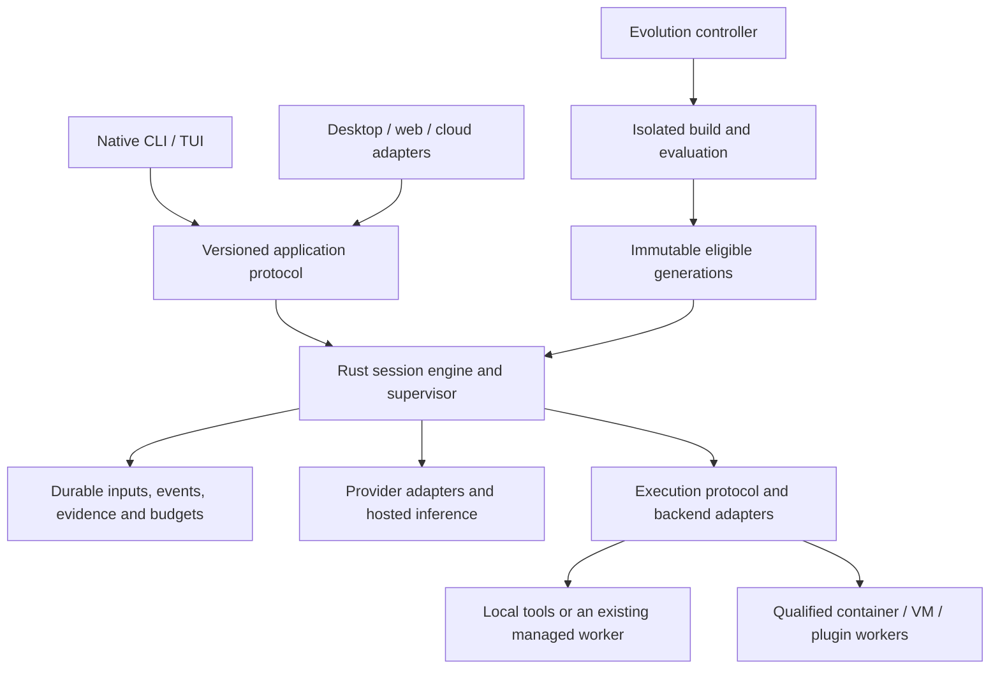

# Native 0sec harness architecture

Status: proposed architecture for `the-great-rust-rewrite`, 2026-09-18.
The destination is a Rust-native CLI and engine. This document defines migration
and qualification gates; it does not assert the replacement is implemented.

## Branch and integration policy

`the-great-rust-rewrite` is the integration branch. `main` remains the working
release line during migration. Use small topic branches/worktrees from the
integration branch for independent modules. One integrator owns shared wire
types, dependency versions, Cargo.lock, and cross-module validation.

Bring `main` fixes into the integration branch regularly. Merge useful compatible
improvements to `main` independently where possible. Avoid rewriting a shared
branch's history. Do not switch release installation or cloud images merely
because the Rust workspace builds. Retire legacy paths only after their
replacement passes the relevant behavior and deployment gates.

Every migration task records: old entry points and tests, new owner, input/output
contracts, implementation status, qualified environments, known limitations, and
the condition for removing its temporary adapter. An unsupported command must
report its status, never silently execute a different workflow.

## Design decision

Implement the authoritative harness in Rust: session lifecycle, agent loop,
provider routing, tools, execution supervision, evidence, persistence, budgets,
generation management, CLI and terminal UI. Preserve a language-neutral extension
protocol for generated Rust, Python, TypeScript and external tools. A Rust host
does not require every guest tool, web frontend or cloud service to use Rust.

Temporary TypeScript bridges are migration mechanisms with explicit retirement
criteria, not the final engine. Security-quality improvement is measured
separately from language migration or successful compilation.



The evolution controller uses the same storage, accounting and execution services.
It is not a second independent agent runtime or permission system.

## Lessons retained from the reviewed implementations

| Source | Adopt | Qualification caveat |
| --- | --- | --- |
| Codex | Typed application client, generated schemas, distinct execution protocol | Application interface can be embedded; do not require a daemon everywhere |
| OpenCode | Durable prompt admission, explicit steer/queue semantics, journal-backed replay | Its newer migration is incomplete; durable events do not imply distributed execution leases |
| oh-my-pi | Pure edit planning with authority-owned commit, provider-turn concurrency limits, explicit context projection | Workspace copies/worktrees are not security sandboxes |
| DSH/Cordis | Dependency-aware components, owned registrations/resources, immutable request ownership | Hot reload is not durable recovery, automatic improvement, or reversal of external effects |
| Codex Security | Complete candidate accounting and source-finding provenance during parallel reduction | Complete accounting is not proof that a finding is valid |
| Existing 0sec | Generation leases, executable plugins, evaluation receipts, pinned runs and specialist oracles | Preserve real semantics while addressing documented qualification gaps |

Pinned reference source:

- [Codex application client, 0.155.0](https://github.com/openai/codex/blob/rust-v0.155.0/codex-rs/app-server-client/src/lib.rs)
- [OpenCode durable session implementation](https://github.com/anomalyco/opencode/blob/b02acc1e30ef55f7f181fec8d2f241d26f022683/packages/core/src/session.ts)
- [OpenCode event journal](https://github.com/anomalyco/opencode/blob/b02acc1e30ef55f7f181fec8d2f241d26f022683/packages/core/src/event.ts)
- [OMP pure edit engine](https://github.com/can1357/oh-my-pi/blob/62a4aa98a4b52f829a3ae9a5247ca8db4e5f810c/crates/pi-edit/src/lib.rs)
- [OMP provider concurrency](https://github.com/can1357/oh-my-pi/blob/62a4aa98a4b52f829a3ae9a5247ca8db4e5f810c/packages/coding-agent/src/task/provider-concurrency.ts)
- [DSH architecture](https://github.com/deepseek-ai/deepseek-harness/blob/ddefc45fbc7f8e46dd73185e68295696d1297887/docs/architecture.md)
- [DSH dynamic runner](https://github.com/deepseek-ai/deepseek-harness/blob/ddefc45fbc7f8e46dd73185e68295696d1297887/packages/extensions/cordis-host-runner/README.md)
- [Codex Security reduction validation](https://github.com/openai/codex-security/blob/70d5b2edae13992a73003bdc568c7b96117edb80/plugins/codex-security/mcp-app/src/deep-scan/artifact-validation.ts)

These sources were inspected; their tests and comparative performance were not
rerun. Claims from project marketing are not acceptance criteria.

## Module boundaries

| Rust subsystem | Owns | Must not own |
| --- | --- | --- |
| Protocol/domain | Versioned commands, events, errors, schemas and compatibility | Live handles, secrets or UI types |
| Storage/evidence | Durable input/event journal, immutable artifacts, findings lineage, migrations | Model-generated promotion authority |
| Providers/catalog | One normalized model turn; endpoint, auth, protocol and capability adapters | Session history mutation or the tool execution loop |
| Agent/context | Tool loop, context projection, turn state, steering and compaction | Terminal rendering or arbitrary guest execution |
| Supervisor | Session/task ownership, concurrency, budgets, cancellation and handoff | Reimplementing cloud tenancy or billing |
| Tools/edit | Typed operations; pure parse/stage/preview plus mediated commit | Ambient permission inferred from model output |
| Execution | Local/container/VM/managed-worker adapters and confirmed lifecycle outcomes | Findings confirmation based solely on process success |
| Components/evolution | Generation graphs, leases, evaluation and activation state machines | Rewriting the authority/evaluator as part of candidate promotion |
| Security workflows | Discovery, reproduction, repair, replay and specialist oracles | Claiming that scaffolding equals executed verification |
| CLI/TUI/client | Input, display, interaction and transport | Direct database access or construction of provider runtimes |

Generate external schemas and client bindings from one authoritative contract.
Prefer native typed calls internally and framed versioned RPC across process
boundaries. Transport and deployment must not change command semantics.

## Durable session and side-effect model

Persist accepted input before waking its session owner. A caller-selected command
ID deduplicates exact retries; reusing an ID with different content fails.
Admission acknowledgement is distinct from completion. Serialize work within a
session and allow concurrency across sessions. Distinguish steering at a defined
turn boundary from work queued for the next idle boundary.

Persist model requests, tool intent and terminal outcomes with operation IDs.
After a crash, a tool with unknown external completion is reconciled or reported
as unknown; it is not blindly re-executed. Replayed UI history does not re-run
side effects. Durable event cursors include session identity and sequence, and
clients recover with an explicit snapshot/history protocol if retention expires.

Keep the immutable audit history separate from lossy model-context projections.
Compaction cannot erase authority, spending, findings or evidence. Store original
provider message metadata needed for provider-specific continuation.

Separate limits for agents, provider requests, execution workers and evaluation
jobs. Release provider-request slots before waiting for tools or child agents.
Generation disposal is an awaited lifecycle operation; destructors alone cannot
guarantee asynchronous cleanup or recovery after abrupt process death.

## Self-learning, self-writing and self-evolution

These are three different capabilities:

1. Learning retains revision-aware notes, lessons and reusable skills with
   provenance, relevance and invalidation. Successful storage is not a measured
   improvement. Tenant-private knowledge is not automatically global knowledge.
2. Self-writing creates new executable tools or component candidates through the
   existing authorized broker, with immutable source/build identities. Structural
   admission does not label a candidate as empirically better.
3. Self-evolution evaluates alternatives against a pinned baseline, development
   cases, hidden controls and retention tasks, then promotes eligible generations
   according to the configured policy and budget.

Artifact state and runtime activation remain separate:

```text
Artifact: proposed -> built -> evaluated -> accepted/rejected -> canary -> eligible
Runtime:  staged -> preparing -> ready -> active -> draining -> retired
```

An immutable generation manifest binds engine artifact, component/lens/plugin
digests, protocol/state versions, configuration, policy and evaluation receipts.
Each running invocation pins its generation. Prepare dependencies and migrate
state before publishing the new active epoch. Retire resources in reverse
dependency order. Reject stale generation-bound UI actions and tool results.

Persist campaign reservations, settlements, proposal lineage and evaluation
exposure across restarts. Restart cannot reset a spending limit. Candidate code
cannot edit the scoring contract, hidden expected answers or historical receipts.
Re-evaluate the combined generation when integrating independently good changes.

Rollback chooses a retained implementation with current compatible state. It
does not rewind history, refund actual usage, undo network requests, or restore
availability just by changing a generation ID. Track runtime health separately
from selected identity and report failed recovery explicitly.

Use versioned subprocess RPC for general generated components. Consider a WASM
backend for bounded transforms whose dependencies fit declared host interfaces;
it uses the same registry and authority. Compile native Rust candidates in the
isolated build lane, then hand off between processes at a versioned checkpoint.
Arbitrary native dynamic-library unloading is not the default extension strategy.
Declarative views remain portable between Rust terminal and web clients;
existing React/ESM factories require an explicit compatibility adapter or rewrite.

Current 0sec sources to preserve include `plugins/live-harness.ts`,
`plugins/executable.ts`, `plugins/protocol.ts`, `improvement/`,
`console/session-checkpoint.ts`, and CLI `dev-engine-updates.ts`. Cordis 4.0.2 is
already used. Long-horizon crash recovery and persistent campaign accounting
remain qualification gaps, not features granted by the dependency.

## Local and cloud compatibility

Support three independently selected modes:

- Local engine/tools and direct provider credentials.
- Local engine/tools with hosted inference and server-owned provider credentials.
- Managed cloud worker running the same native engine inside the cloud's outer
  execution environment.

The existing cloud boundary launches a process/image and consumes output; it does
not require the engine to be TypeScript. Preserve command/option semantics,
`0SEC_*` environment variables, opt-in `0SEC_EVENT_*` records, `0SEC_RESULT`,
atomic `0SEC_REPORT_PATH` reports, finding schemas, artifact handoff, usage totals,
and command-specific exit semantics. Exit 1 is not universally an execution error.
Initially provide an adapter from canonical native events to this existing ABI.

Keep cloud identity, scheduling, billing and dashboard in their existing
services. Hosted inference is not the same as hosted execution. Managed scans
may use a selected direct provider route; do not silently reroute them through
the consumer inference gateway. Preserve authoritative model/wire capability
discovery and account attribution.

Resolve generation identity once at run admission. Pin children and retries to
that generation; record explicit migrations. Publish candidate generations by
cohort and change future dispatch atomically on rollback. Keep private guidance
tenant-scoped and separate from approved globally shared lenses. Shared
extensions require a promotion path; one tenant's successful experiment is not
automatic fleet-wide deployment.

Cloud execution already supplies an outer sandbox. Do not require nested Docker
or KVM for all workers. Advertise backend capabilities and reject unavailable
workloads explicitly. Distributed owners require lease/fencing semantics beyond
the process-local session actor; durable event storage alone is insufficient.

## Implementation sequence and acceptance gates

1. **Contracts and inventory:** freeze compatibility fixtures for current public
   commands, reports, events, provider message behavior, plugin broker and
   cloud-worker integration. Document deliberate behavior fixes separately from
   parity. Correct benchmark aggregation before comparing quality claims.
2. **Durable native engine foundation:** protocol, storage, session actor,
   operation ledger, cancellation, generation manifests and accounting. Prove
   duplicate admission, crash/restart and unknown-outcome handling without paid
   model calls.
3. **One complete workflow:** native provider turn, tools, offline execution,
   evidence, approval, cancel and resume through the same application client.
   Preserve model-facing tool errors and truncation where behavior matters.
4. **Native UI and deployment adapters:** terminal, headless and managed-cloud
   interfaces over that engine. Prove actual packaged binaries, event/report
   compatibility and lifecycle in each advertised environment.
5. **Specialist workflow migration:** findings/repair/replay, scans/reviews,
   binary/kernel/VM tooling, providers, MCP and plugins, each with independent
   inventory and acceptance gates. Do not credit unsupported workflows as parity.
6. **Evolution qualification:** sandboxed authoring, controlled comparisons,
   generation activation, failed preparation, rollback, persistent spending and
   multi-generation recovery. Evaluate useful learning separately from lifecycle.
7. **Cutover:** differential behavior checks, matched quality/cost evaluation,
   measured startup/RSS/interaction, release/install matrix, cloud canaries and
   tested rollback. Change defaults and retire legacy code only after these pass.

Run comparisons on fixtures and isolated targets, not by duplicating real-world
side effects. Existing behavior is one reference, not an instruction to preserve
known bugs. Keep valid unique findings, false positives, retained capabilities,
patch regressions, failures, cost and latency separate. Report per-attempt rates
and pass@k separately; include all parallel-agent and evaluation costs.

## Current implementation status

The experimental workspace now includes a versioned protocol, durable SQLite
session and budget state, a native engine and line console, explicit Docker/smolvm
snapshot execution, Responses/Chat/Anthropic inference and source-preserving
finding reconciliation. Completed agent conversations continue from immutable
journal records across restarts. Generation-bound plugin graphs retain durable
invocation leases; an offline subprocess runner validates one correlated native
RPC result. This does not implement an evaluator, bidirectional broker or native
process hot replacement. Read-only cloud metadata has a separate bounded client.

Real local Docker, smolvm engine/agent and fixture-only Node plugin smoke tests
have passed. Native inference and restart/accounting behavior are tested against
local HTTP fixtures; no live provider, detection-quality or cloud release
qualification is implied. Raw execution bytes use base64 on the JSON wire.

The production CLI remains TypeScript. Agent orchestration, full tool/provider
coverage, engine/generation integration, full-screen TUI and command parity remain work. The protocol
is still experimental. Consult `rust/MIGRATION.md` and individual crate READMEs
for feature and environment limits rather than treating the foundation as a
replacement release.

`rust/EXECUTION-DESIGN.md` contains the detailed first execution-path proposal.
`2026-09-18-rust-codex-assessment.md` records the earlier competitive and benchmark
review. This architecture incorporates later OMP, OpenCode, DSH and cloud reviews.
