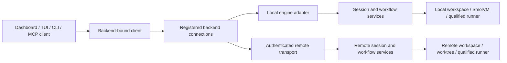

# One frontend, multiple execution backends

Status: source-grounded design; the existing workflow runtime is merged. Remote
backend registration and routing described here are not implemented yet.

## What Codex actually separates

Inspected the public OpenAI Codex Rust repository at commit
[`236be1ad9f6169269bbad436a0eca41d21948680`](https://github.com/openai/codex/tree/236be1ad9f6169269bbad436a0eca41d21948680).
The desktop UI shown in the reference image is not in this public Rust tree.
The source proves a shared frontend/backend contract, not that the proprietary
desktop UI simultaneously multiplexes an arbitrary number of backends.

| Boundary | Evidence in the Rust implementation |
|---|---|
| Shared client facade | [`AppServerClient`](https://github.com/openai/codex/blob/236be1ad9f6169269bbad436a0eca41d21948680/codex-rs/app-server-client/src/lib.rs#L340) selects in-process or remote implementations. The same request, notification, approval-response, event, and shutdown methods dispatch through either variant. |
| Local execution without a second protocol | [Client README](https://github.com/openai/codex/blob/236be1ad9f6169269bbad436a0eca41d21948680/codex-rs/app-server-client/README.md#L28) describes typed in-process channels retaining the app-server response contract. Local execution does not require a separate UI-specific engine API. |
| Remote transport | [`remote.rs`](https://github.com/openai/codex/blob/236be1ad9f6169269bbad436a0eca41d21948680/codex-rs/app-server-client/src/remote.rs#L73) defines WebSocket and Unix-socket endpoints, authentication, initialization, correlated requests, and disconnection events. |
| A frontend using either implementation | [TUI construction](https://github.com/openai/codex/blob/236be1ad9f6169269bbad436a0eca41d21948680/codex-rs/tui/src/lib.rs#L495) creates a remote app-server client; the same module also starts the in-process client. |
| Backend-owned filesystem semantics | [`AppServerPath`](https://github.com/openai/codex/blob/236be1ad9f6169269bbad436a0eca41d21948680/codex-rs/app-server-client/src/path.rs#L1) and the client platform/home accessors describe the connected server's paths and platform. A remote path is not a laptop path. |
| Model selection versus execution selection | [Thread parameters](https://github.com/openai/codex/blob/236be1ad9f6169269bbad436a0eca41d21948680/codex-rs/app-server-protocol/src/protocol/v2/thread.rs#L62) separately carry model/provider, working directory, and sticky environments. [Turn parameters](https://github.com/openai/codex/blob/236be1ad9f6169269bbad436a0eca41d21948680/codex-rs/app-server-protocol/src/protocol/v2/turn.rs#L193) can override the environment. |
| Tool execution environment | [`EnvironmentManager`](https://github.com/openai/codex/blob/236be1ad9f6169269bbad436a0eca41d21948680/codex-rs/exec-server/src/environment.rs#L73) manages concrete local and remote process/filesystem environments. Connecting the frontend to a remote harness is distinct from giving a harness a remote executor. |
| Approval and event routing | [Outgoing messages](https://github.com/openai/codex/blob/236be1ad9f6169269bbad436a0eca41d21948680/codex-rs/app-server/src/outgoing_message.rs#L116) distinguish directed connections and broadcasts, correlate server requests, and route thread messages to subscribers. [Thread state](https://github.com/openai/codex/blob/236be1ad9f6169269bbad436a0eca41d21948680/codex-rs/app-server/src/thread_state.rs#L316) tracks connection subscriptions. |
| Backend-owned history | [Thread manager](https://github.com/openai/codex/blob/236be1ad9f6169269bbad436a0eca41d21948680/codex-rs/core/src/thread_manager.rs#L1205) resumes persisted rollouts; rendering and transport do not own the execution history. |

The [official app-server documentation](https://learn.chatgpt.com/docs/app-server)
describes initialization, typed schema generation, bidirectional approval requests,
stdio/Unix-socket/WebSocket transports, and bounded request ingress. Its WebSocket
surface is labeled experimental. We should adopt the separation and lifecycle
semantics while qualifying our own transport and authentication.

The optional outbound Code Mode host is another boundary, distinct from the
inbound app-server listener. Transport descriptions differ between the fetched
documentation and this pinned source: the source's
[`code_mode_host.rs`](https://github.com/openai/codex/blob/236be1ad9f6169269bbad436a0eca41d21948680/codex-rs/app-server/src/code_mode_host.rs#L21)
uses an optional HTTP(S)/gRPC provider. Do not treat a documentation flag as proof
of a transport implemented in a different release.

## The corresponding boundaries in 0

The dashboard currently has a single same-origin engine. `packages/dashboard/src/api.ts`
owns the local control token and HTTP transport. `packages/dashboard/src/lib/event-stream.ts`
owns authenticated SSE. `packages/dashboard/src/console/use-console-workspace.ts`
polls session snapshots and events. `packages/cli/src/commands/dashboard.ts`
constructs one gateway, workflow service, operator service, and scheduler against
local stores.

`packages/shared/src/desktop-console.ts` already supplies versioned snapshots and
events. `packages/core/src/workflow-runner.ts` supplies transport-independent typed
execution. These are the foundations to reuse. `packages/cli/src/web/console-gateway.ts`
currently couples local paths, account/runtime selection, approval decisions, and
session execution. Its checks belong to the engine performing the work.

The workbench bridge is a host/guest execution controller, not a general frontend
connection transport. Its SmolVM CLI bridge does not forward bidirectional stdin,
so it cannot carry MCP stdio. A remote engine connection should have an actual
request/event/approval protocol rather than reuse output capture as a connection.

## Proposed architecture

Keep four independent selections:

| Selection | Meaning |
|---|---|
| Backend connection | The engine that owns sessions, runs, approvals, and retained results. |
| Workspace | A repository/directory/worktree on that engine, identified in that engine's namespace. |
| Execution environment | The engine's admitted local, SmolVM, container, or other qualified runner. |
| Model connection | The engine's configured provider/account/model. |

The composer can show backend and workspace beside branch/worktree controls,
while model selection remains separate. The screenshot is a useful interaction
reference, not evidence that a model dropdown selects an execution machine.

Define a `BackendDescriptor` with stable ID, display name, transport type,
connection status, protocol version, and advertised capabilities. Authentication
uses a credential reference owned by the trusted connection service; descriptors
and browser persistence do not contain provider keys or remote bearer secrets.

A `BackendClient` exposes typed request and event-subscription methods. Each
instance is permanently bound to one backend ID. Start with a local adapter over
the existing HTTP/SSE API. Keep UI code dependent on this contract rather than
introducing backend-specific execution branches into components.

Session, workspace, run, schedule, artifact, and approval references must include
`backendId`. React Query keys, saved drafts, navigation, and event cursors use the
same namespace. Selecting another backend changes which resources are displayed;
it does not move an active run, reuse its approval, or reinterpret its workspace.

## Implementation sequence

1. Add the backend descriptor/capability handshake and local `BackendClient`.
   Convert existing API call sites to the client while preserving local behavior.
2. Namespace caches, navigation, drafts, and resource references. Prove two engines
   with identical local session/run IDs cannot collide or receive each other's
   commands, results, or approvals.
3. Add explicitly registered connections through a local trusted proxy. Initially
   reach remote loopback engines through SSH tunnels. Keep the browser same-origin;
   do not let `webFetch` send control credentials to arbitrary supplied URLs.
4. Make workspace listing/selection and file access backend-owned. Bind every
   session and run to its chosen workspace, environment, and model connection.
5. Qualify direct authenticated remote transport: TLS, version negotiation,
   bounded ingress, request IDs, idempotency, event cursor replay, reconnect, and
   connection-specific approval routing. Preserve server-side scope and action
   checks. Add a backend selector only when the underlying isolation works.
6. Support independently deployed remote engines and remote executors as separate
   capabilities. A remote engine can own its own local executor; a local engine
   may later use a qualified remote executor without changing frontend identity.

## Required lifecycle semantics

The engine owns run state and history. Losing a UI connection means disconnected,
not completed or cancelled. Reconnect reads an authoritative snapshot and replays
events after the acknowledged cursor. Cancellation targets the owning backend and
requires acknowledgement; a stale local status does not prove that work stopped.

Approval requests carry backend/session/run/request identity and a scope/operation
digest. Responses return to that exact owning connection and request. Model or
workspace changes cannot silently transfer pending approvals. Existing target
authorization, candidate proof, provider-usage accounting, and filesystem gates
remain enforced on the execution engine.

Foreground CLI and stdio MCP host lifetimes retain their current cancellation
semantics. A persistent daemon connection needs a separately defined detach policy;
adding network transport must not accidentally change disposal into remote-run
cancellation or silently introduce unattended execution.

## Acceptance checks

- The same UI can select two registered engines without cache/draft/ID collisions.
- Closing and reconnecting the frontend preserves engine-owned run history.
- Disconnect, cancellation requested, cancellation acknowledged, and completion
  appear as distinct states.
- Remote paths are resolved by the remote engine; laptop paths are not guessed or
  rewritten from prose.
- Provider and connection credentials remain with their owning engine/connection
  service; switching backend cannot forward an unrelated account.
- An approval from engine A cannot authorize a request on engine B.
- Unsupported capabilities fail before dispatch; existing local workflows and
  SmolVM restrictions continue to work through the local adapter.
