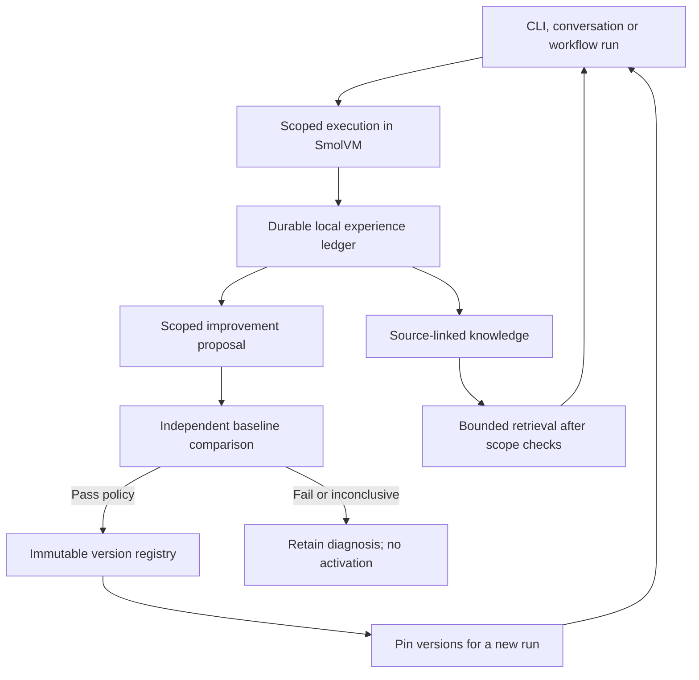

# Continuous learning across the engine and workflows

Status: architecture and implementation plan, researched 2026-10-01. The initial
service now implements local events/outbox, source-note mirroring and invalidation,
workflow version history/restore, source-linked console lesson save/recall, the
Learning UI, and registry-backed evolution
provenance through `0 learning evolve`. The default background worker makes no
model calls. It can suggest restoring earlier workflow instructions after repeated
failures; suggestions require review and never apply themselves.
Independent security capability evaluation and signed release distribution remain
follow-up work. Five independent
research passes covered the code, learning research, evaluation, workflow UX,
and enterprise boundaries. Implementation tests exercise persistence, lifecycle
integration, source invalidation and evaluator identity. A small live paired
source-review benchmark found no performance lift. A later [real console comparison](../benchmarks/learning-console-paired-2026-10-02.md) also found no accuracy gain and measured 23.7% more input tokens with remembered context.
Real SmolVM lesson handoff across fresh guests and provider checks are recorded
in the [October 2 qualification report](smolvm-qualification-20261002.md); the selected
full toolbox still requires a rebuilt image.

## Decision

Build a customer-engine-owned Learning service shared by CLI, web conversations,
and workflows. Begin with source-grounded knowledge and evaluated changes to
skills, workflow instructions, detector lenses, verification recipes, and routing.
Keep provider model weights unchanged initially.

Use the existing memory, evolution, registry, and benchmark implementations.
Unify provenance and lifecycle ingestion; do not merge their distinct trust
levels into a single “learned” flag. Start as modules and a durable worker within
the engine, not a collection of new microservices.

The initial product promise is: “0 saves source-linked lessons for later
investigations and lets you review suggested workflow changes.” Lessons are
untrusted hints, and operational restore suggestions have not passed a security
benchmark. Evaluated evolution has its own separate evidence. Every run provides observations;
every run does not necessarily improve capability.

## Initial code audit

This table records the audit before the foundation described above was implemented.

| Component | Implemented behavior | Missing connection |
|---|---|---|
| [Run contribution](../../packages/core/src/telemetry/run-contribution.ts) | Typed manifests and sequenced transitions; separate execution, security, verification, remediation, version and usage outcomes | Optional contribution capture is not a universal local learning ledger |
| [Hunt memory](../../packages/core/src/memory/hunt-memory.ts) | Bounded, redacted local notes; cited source hashes; stale-note exclusion | Common provenance and measured retrieval usefulness |
| [Repair memory](../../packages/core/src/secure/project-memory.ts) | Revision-valid repair hints and outcomes | Transferable recipes with applicability conditions |
| [Triage memory](../../packages/core/src/triage/memories.ts) | Scoped human false-positive reasons | True-positive recording is currently a no-op; dashboard status changes do not automatically supply labels |
| [Lens observations](../../packages/core/src/stages/lens-synthesis/feedback.ts) | Durable observations, evidence digests, consent, fixtures and processing lifecycle | Shared terminal-run ingestion and independent service scheduling |
| [Evolution controller](../../packages/core/src/improvement/loop.ts) | Candidate snapshots, paired evaluations, development feedback, canaries and rollback | Workflow-specific learning and security outcome evaluation |
| [Evolution safety](../../packages/core/src/improvement/safety.ts) | Durable cost/exposure reservations and provenance checks | Statistical protection against repeated selection is separate from an exposure counter |
| [Artifact registry](../../packages/core/src/improvement/registry.ts) | Immutable snapshots, activation states, compare-and-swap promotion, pinning and rollback | Shared workflow and knowledge version references |
| [Proposal learning](../../packages/core/src/research/proposal-learning-loop.ts) | Evidence-gated replay and bounded ranker updates | Exported/tested, but no production workflow/CLI invocation found |
| [Workflow runtime](../../packages/core/src/workflow-service.ts) | Shared execution lifecycle, idempotency and bounded events | Common learning consumer for terminal outcomes |
| [Workflow persistence](../../packages/db/src/security-workflows.ts) | Optimistic revisions and execution snapshots | Full immutable definition history and candidate/active pointers |

Craft memory also offers multi-tier LLM consolidation. Its distilled guidance
does not currently have the evidence and promotion controls needed for broad
automatic use. A learned triage router exists, but public runtime inference from
a static artifact is distinct from continuous model training.

## Architecture

### 1. Record experience reliably

Reuse the run manifest vocabulary as a local event envelope, independently of
optional contribution export. Record workflow/run/step IDs, selected backend,
source revision, environment/tool/model versions, artifact digests, actual
outcome, evidence strength, cost and elapsed time. Prefer structured observations
and observable tool results; do not require hidden model reasoning.

Write terminal events and durable outbox records transactionally where possible.
Use stable event IDs and idempotent consumers. A worker crash must not lose a
completed verification or create duplicate lessons. All entry points should
submit to this same lifecycle, rather than each UI implementing learning.

Keep outcome categories distinct. Provider failures, cancellation, insufficient
scope, missing authentication and unavailable validators are operational or
inconclusive outcomes. They are not evidence that a target is safe. An agent
assertion is a hypothesis; a qualifying independent observation is proof.

### 2. Retain applicable knowledge

Separate repository facts, operator preferences, and procedural hypotheses.
Repository facts cite files and hashes and become stale when their evidence
changes. Procedures have explicit environment/task preconditions, exceptions,
source events and counterexamples. Retain failures in history; turn them into
guidance only after establishing why they failed.

Apply tenant/project/document permissions before retrieval and again before
use. Retrieve a small relevant set rather than injecting complete histories.
Record which entries were used and the subsequent outcome, then evaluate
whether retrieval helps. Add contradiction, expiry, disable/delete and descendant
retraction. An embedding index can improve search later; it is not the learning
architecture itself.

Source-grounded factual retention can be automatic under local settings.
Consolidated procedural guidance starts as a candidate. Retrieved material never
grants permissions or changes tool authorization. Preserve independent verifier
isolation from candidate claims and evaluation answers.

### 3. Improve behavior through versioned candidates

Group recurring, corroborated experiences and propose one bounded change:
workflow step instructions, a skill, detector lens, verification recipe, routing
rule or budget policy. The proposal includes its exact diff, intended effect,
applicability, supporting events and counterexamples.

Keep candidate generation, evaluation and activation as separate authorities.
The proposer cannot edit the evaluator, labels, target images, release policy or
held-out answers. Use the existing registry semantics rather than live rewriting
of production prompts. New runs pin workflow, skill, policy and relevant knowledge
versions. Existing runs retain their original versions.

Local policy may permit automatic activation after qualifying evaluation; human
review need not gate every memory entry. Activation cannot expand scope or
credentials. Existing schedules pin reviewed workflow revisions and pause after
edits; learned versions must preserve that behavior.

### 4. Measure security improvement

The current evolution evaluator provides useful sealed snapshots, exact-output
grading, alternating baseline/candidate order, development/holdout/negative
lanes and repeat checks. Exact fixture output remains a contract test, not proof
of better vulnerability discovery. Bridge promotion to existing benchmark
tournaments and trusted execution oracles.

Maintain three separate datasets: chronological development experiences,
promotion/regression cases, and protected release cases. Split by project,
package family and patch lineage; near-duplicate files are not independent
tasks. Repeatedly consulted promotion cases become validation data. Refresh
sealed release cases and exclude their solutions from learning and retrieval.

Compare the same model/harness with no memory, retrieval only, current skills,
and candidate skills under equal budgets and environment versions. Use paired
outcomes and uncertainty, not point estimates alone. Repeating one task does
not increase the number of independent cases. Existing same-corpus canaries
measure execution stability; add fresh authorized tasks for generalization.

Provide two promotion paths: increased capability within cost/latency limits,
or lower cost with demonstrated capability noninferiority. Track:

- Independently confirmed findings and clean-control false positives.
- Proof strength and replay stability by vulnerability class.
- Repairs that stop reproduction while retaining required functionality.
- Previously solved-case retention and task-family regressions.
- Cost per confirmed outcome and time to proof.
- All-attempt yield, gradeable-case results and infrastructure failure rate.

Start with existing browser oracle and evidence integrity tests, source-audit
and npm benchmarks, and stratified CyberGym reproduction. Description-assisted
reproduction and autonomous discovery should be reported separately. A fresh
browser execution signal, a response heuristic and an ambiguous callback do
not belong in one undifferentiated “verified exploit” metric.

## SmolVM and enterprise deployment

Keep durable ledger, knowledge, queue, workflow versions and registry outside
disposable execution VMs, within the selected customer deployment. Each SmolVM
receives only its scoped workspace, authorized tools and pinned relevant
artifacts. The host ingests bounded results and evidence. Run candidate
generation/evaluation in separate disposable environments with explicit budgets.
The implemented console handoff validates bounded source-linked lesson prose
against host-owned scope and cited file hashes, then persists it on the host.
Fresh guests fetch current lessons before model calls and recheck the hashes.
Disabled lessons stay disabled across new run records. Standard mode requires
host-approved scope; an explicit host YOLO workspace grant also covers child
directories. Guest state, prose and transcripts do not create authority. This
roundtrip has been tested in three fresh VMs. It does not qualify every toolbox
image, provider or validator.

Learning inference uses the customer's selected approved provider or self-hosted
model. Private provider connectivity does not by itself mean inference executes
inside the customer's VPC. Do not introduce an automatic hosted judge or export
channel. Memories, embeddings, derived fixtures and optional adapters inherit
their source's residency and access requirements.

Vendor releases can distribute signed generic/public/synthetic skill and
validator packs inward. Customer-derived exports are separately authorized and
reviewed. Signatures establish origin/integrity; tenant-local evaluation
establishes suitability. Fine-tuning or federated learning is later work requiring
stable labeled datasets, measured benefit and deployment support.

## Product surface

The Learning page uses the shared page layout with **Lessons** and **Suggestions**.
Ordinary chat completion and run identifiers stay in the internal ledger, not the
main Learning view. Show the lesson itself, its supporting files and whether it is
current, stale or disabled. A lesson is useful investigation context, not evidence
that a vulnerability exists or that capability has improved.

Improvement detail shows what changes, supporting evidence, baseline comparison,
regressions, cost and activation history. Workflow detail gains Learning and
Versions sections; runs link to pinned versions. Avoid an unexplained learning
percentage or a blanket success badge.

Findings feedback distinguishes false positive, duplicate, out of scope,
accepted risk and confirmed miss. Product states such as suppressed or done do
not automatically become training labels. A test passing does not alone mean a
security defect is fixed.

Suggested engine-owned APIs cover events, knowledge, candidates, evaluation,
activation/rollback and workflow versions. Bind caches and object references to
the backend identity, preserving existing selected-engine isolation.

## Delivery sequence

1. Local experience ledger/outbox and terminal hooks for verification, repair and
   workflow completion. Preserve explicit evidence strengths and non-labels.
2. Adapters for existing source notes, repair/triage memory and lens observations;
   provenance, invalidation and a Learning activity view.
3. Immutable workflow definition history and generated candidate revisions;
   pinned execution, existing schedule review behavior and rollback receipts.
4. One constrained learner with paired security evaluation. Start with verification
   recipes or detector lenses, demonstrate measurable benefit, then expand.
5. Configurable budgeted automation, fresh-task canaries, generic signed release
   packs and optional customer-controlled sharing.

## Research basis and limits

This recommendation is a synthesis of primary research and repository inspection;
none of these papers proves the best production cybersecurity architecture.

- [WikiSkill, v1](https://arxiv.org/html/2608.27454v1) separates traces, consolidated
  knowledge and active skills, with evaluation gates. Its skill injection does
  not establish retrieval quality or multi-hour workflow performance.
- [ACE, v3](https://arxiv.org/html/2510.04618v3) supports incremental playbook
  updates rather than repeated full rewrites. Reflection quality and context
  accumulation remain limitations.
- [Evo-Memory, v2](https://arxiv.org/html/2511.20857v2) distinguishes fact recall
  from procedural reuse and studies task streams. Its results motivate testing
  chronology and negative transfer, not assuming retained failures help.
- [SkillsBench, v3](https://arxiv.org/html/2602.12670v3) reports benefits from curated
  skills and regressions on some tasks. Its self-generated condition produces
  skills before attempting the current task; it does not test the proposed
  verified cross-run evolution loop.
- [Procedural memory, v1](https://arxiv.org/html/2508.06433v1) separates memory
  construction, retrieval and update; its benchmark scope is narrower than
  production security engagements.
- [Search-time contamination](https://arxiv.org/html/2606.05241v1) motivates
  keeping benchmark solutions and verifier internals out of learning inputs.
- [CyberGym](https://arxiv.org/abs/2506.02548) and its
  [official implementation](https://github.com/sunblaze-ucb/cybergym) provide
  real-vulnerability reproduction tasks; [CyberGym-E2E](https://www.cybergym.io/cybergym-e2e/)
  separates discovery, proof, repair, functionality and intended-bug attribution.
- [AI Agents That Matter](https://arxiv.org/abs/2407.01502) motivates joint capability
  and cost evaluation. [Adaptive holdout research](https://arxiv.org/abs/1506.02629)
  explains why exposure counters alone are not formal overfitting protection.
- [MINJA](https://arxiv.org/abs/2503.03704) and
  [MEXTRA](https://arxiv.org/abs/2502.13172) establish memory poisoning/extraction
  concerns; they do not establish a universal sanitizer defense.
- [SLSA provenance](https://slsa.dev/spec/v1.1/provenance) and
  [TUF](https://theupdateframework.github.io/specification/latest/) inform
  artifact lineage and authenticated/fresh release distribution, independently
  of behavioral evaluation.
