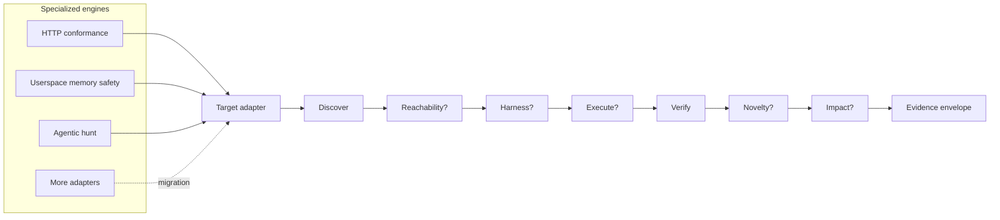
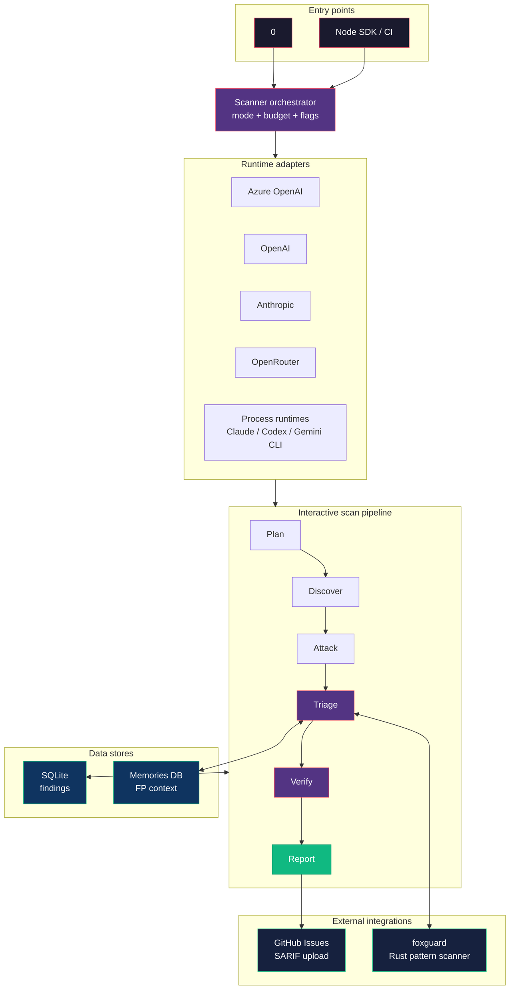

0 is an open cybersecurity harness built on one rule: **reproduce before
trusting.**

For practical setup, start with [Scan Workflows](/scan-workflows/),
[Console](/console/), or [Research Workflows](/research-workflows/).
This page describes the engine's structure.

The harness has several workflow-specific evidence paths:

- **0** orchestrates source and live-target assessments, package audits,
  AI/agent evaluations and research workflows. Parallel discovery, verification
  and fix generation depend on the selected command and configuration.
- **0verse** is the separate in-repo compiled-program evidence producer.
  Its explicit integration is opt-in, not a stage of every scan.

The diagram below describes the research-adapter contract, not the execution
order of all CLI commands.



In that research contract, **discover** and **verify** are mandatory stages.
Unsupported optional stages are marked `skipped`; failed or unavailable proof
stays `inconclusive`. A mandatory verification stage means a result is evaluated,
not that it necessarily reproduces. Discovery output cannot promote itself.

Research evidence envelopes track independent dimensions:

| Dimension | Meaning |
|---|---|
| Proof grade | `candidate → reachable → observed → reproduced → impact-proven` |
| Novelty | `unchecked`, `novel`, `duplicate`, or `inconclusive` |
| Execution privilege | Linux `zero-cap`, Windows `windows-restricted`, `privileged`, or `unknown` — with an evidence basis |
| Provenance | Target/build/config identity, producer, model, attempt, run |
| Native evidence | Protocol attempts, sanitizer crashes, hunt records, VM proofs |

### Reproduced is not disclosure-ready

A reproduced result still has to clear more gates before it can be disclosed.
Disclosure requires reproduced evidence **plus** a real novelty receipt; scope,
publishability, redaction, and operator policy are all separate downstream
gates. A proof grade never implies attacker privilege.

Privilege claims carry their own attestation gates, and all of them **fail
closed**:

- **Linux zero-cap** — runtime attestation of non-root real and effective UIDs,
  an all-zero effective capability set, `no_new_privs` (so a later exec can't
  regain privilege), and a digest-bound artifact.
- **Windows LPE** — a separate token-transition gate; Linux UID/cap facts are
  never treated as Windows proof. Needs a Windows context, a retained
  token-attestation artifact and receipt, exact Canary build/campaign/worker/
  manifest binding, ≥2 target trials and ≥2 clean controls with distinct
  captures, a low/non-elevated start token, and a distinct high-integrity admin
  or LocalSystem finish token. Benchmark rows and automatic disclosure fail
  closed; human review stays mandatory.
- **Linux kernel N-of-K** — every reproduced boot supplies a bound receipt, and
  the aggregate manifest is the evidence artifact. It binds each dmesg digest
  and rejects mixed kernels or repeated boot IDs.

These are trusted-orchestrator bindings (VM kernel, guest init, launcher), not
hardware-backed attestation of a hostile worker. Human review remains
mandatory. See [Research Workflows](/research-workflows/) for the research
contracts. The deterministic replay JSON in [Verification Results](/verification-result/)
is a separate contract, not the schema for every research envelope.

### Adapters

| Adapter | Native proof | Status |
|---|---|---|
| HTTP protocol conformance | Concrete request/response + deterministic RFC oracle | Connected |
| Userspace memory safety | Fuzz loop, sanitizer/Miri crash, saved input, primitive classification | Connected |
| Agentic hunt | Best-of-N records, judge, skeptic/prover, native novelty result | Connected |
| Linux kernel reproducer | Fresh-boot N-of-K signature gate with dmesg binding | Connected |
| Linux external boot matrix import | Versioned vulnerable/patched manifest, unique boot markers, clean-control gate, hashed logs | Connected; explicitly external provenance |
| Windows Hyper-V evidence import | Build/campaign/worker-bound 0verse receipt, clean controls, repeated crash signature, retained dumps | Connected for crash reproduction; LPE disclosure fail-closed until token attestation |
| Mobile static intake | Typed candidates + scoped downstream handoff; no passive promotion | Connected |
| XNU IOKit | Selector discovery, reachability hints, deterministic programs; panic promotion off | Partial, fail-closed |
| Unified web/AI/source/package/on-chain pipeline | Native findings wrapped without rerunning the pipeline | Connected |

### 0verse evidence engine

`0verse` is an in-repo Python evidence producer (the `0verse/` directory), not
an `@0sec/*` package. It handles compiled-program evidence with its own Ghidra,
angr, AFL++, PoV, and notary contracts. 0 consumes only explicit, versioned
interfaces — the opt-in `0verse` binary/NDJSON contract and verified external
receipts. It never bundles 0verse into `@0sec/*`, schedules it as a generic
scan worker, or promotes a hypothesis without the matching proof gate.

A shared differential runner can run identical input against two versions,
builds, configs, or implementations; a failed side is `inconclusive`, never
`divergent`. Novelty providers are pluggable per ecosystem, and zero checked
records can never produce a `novel` verdict.

Research CLI paths emit evidence envelopes and can send findings through a
configured cloud sink. Envelope availability depends on the producing path;
do not assume a legacy finding or a different command's output has the same
schema. Managed storage and access are outside this repository.

Two import paths handle kernel proofs the generic VM runner can't safely
rebuild:

- `0 research linux-matrix` imports externally executed boots. The versioned
  manifest binds build IDs, literal crash/completion oracles, per-boot markers,
  thresholds, and log paths; 0 hashes the manifest, every log, and its
  verdict. The envelope says `executionOrigin: external` and never claims 0
  ran the boots.
- `0 research linux` runs natively, bound to a required literal crash oracle
  (`--expected-signature`). A different KASAN/oops/GPF is recorded but can't
  satisfy the N-boot gate. Each boot contributes its own hashed dmesg artifact,
  so a 2-of-3 claim carries the full three-boot audit trail.

## Interactive scan pipeline

For web pentesting the agent is shell-first: `bash` (curl, python3, sqlmap, …)
is the primary tool, not a fixed set of HTTP tools. LLM and code targets get
specialized tools like `send_prompt` and `read_file`. The agentic scan path
applies triage and a separate verification pass; source, template, replay and
research paths have different evidence contracts. Reports can retain candidates
without independent runtime proof.



The six labels below are a conceptual workflow, not a promise of six separate
agents or exactly two sessions. Native agentic verification uses one bounded
session per candidate; optional discovery fan-out adds other sessions.

```
Plan -> Discover -> Attack -> Triage -> Verify -> Report
```

### 1. Research agent (Plan + Discover + Attack + PoC)

The research session is instructed to:

1. **Plan** — choose likely vulnerability classes and prioritize vectors.
2. **Discover** — map endpoints, detect models, fingerprint technology and
   inspect source when provided.
3. **Attack** — test hypotheses with the target-specific tools.
4. **Record evidence and PoCs** — save the observed request/response or source
   path and, where applicable, executable reproduction steps.

These are model tasks, not a guarantee that every target gets comprehensive
coverage or every saved finding includes a working PoC. Deterministic recon and
specialized pipeline stages can also contribute findings.

When a scope document or challenge description exists, it's passed to the agent
as context — the same way a real pentester receives a brief.

Tool set depends on target type:

- **Web:** shell-first instructions favor `bash`, `save_finding` and `done`.
  Role tool sets can also include `crawl`, `submit_form`, `http_request` and
  other gated capabilities; `browser` depends on browser availability.
- **LLM:** `send_prompt` plus the applicable network-role tools.
- **Scoped source/npm review:** `read_file`, literal `search_files`,
  `list_files` and finding tools. Broader execution tools depend on the caller's
  tool profile; a scoped read-only review is not the full console tool set.

**Budget-aware reflection.** As the turn budget is consumed, the loop can inject
continue prompts so the agent does not spend every turn on one dead end.
The budget depends on the workflow, role, and depth; it is not one universal
40-turn setting. See [Agent Loop](/agent-loop/) and
[Budget Management](/budget-management/).

### 2. Triage stage

The agentic scanner applies default-on holding-it-wrong and evidence-completeness
filters, category oracles, and optional source/PoV/consensus gates. Routing,
tooling and category determine which checks run; several checks make live
requests or model calls. Guarded heuristic rejection can hold protected findings
for verification. See [Finding Triage](/triage/) for actual defaults, evidence
limits and per-finding provenance.

> **EGATS caveat.** The 2026-04-11 ablation found `egatsTreeSearch` regresses
> solve rate on hard challenges at ~10× the cost of the next-worst layer. It's
> removed from the default moat aliases and opt-in only ([0sec#116](https://github.com/0sec-labs/0sec/issues/116)).
> Results varied by slice. npm-bench attribution needs repeated runs;
> [routing research](https://github.com/0sec-labs/0sec/issues/113) remains separate.

### 3. Verify agent (blind validation)

Native agentic verification receives one finding with request/response excerpts,
original analysis, target/authentication and optional review-memory context,
with five turns per finding. It is separate from the original full conversation,
but not blind to all reasoning. Structured consensus is a tool-free model
assessment; template-scan fallback can confirm without replaying.
See [Blind Verification](/blind-verification/) for these distinct contracts.

### 4. Report

Reports retain findings and their evidence/verification state; consumers must
not assume every row has the same proof grade. Formats vary by command and
include terminal, HTML, PDF, SARIF, Markdown, and JSON. A local report is not
automatically published or assigned a public share URL.

### Multi-model roles and advisory evaluators

Different models can serve discovery, review, refutation and fix roles when the
workflow and configured route support them. Multiple sessions do not imply
different providers or statistically independent errors. API child runtimes keep
the parent provider, credential and base URL; a role-model name must work on
that route rather than triggering automatic cross-provider credential discovery.

Opt-in Jev assistance handles bounded browser navigation, memory relevance,
duplicate assessment and red-team attempt feedback. It does not authorize tools
or verify an exploit. Browser decisions return to the main model on ambiguity;
memory context cannot reject a finding; dedupe preserves original evidence;
red-team break detection remains with its judge/oracle. See
[Features](/features/#advisory-evaluations) for explicit data-egress consent,
provider settings and per-evaluator budgets.

## Plugin-first self-evolution

Executable plugins provide versioned guest execution, composition, next-call
activation, source evolution and rollback. The **wired research-preview**
live-harness path adds `agent.driver` and `ui.view` replacement during a task,
with console/tool and TUI host integration. Its
[local measurements](/improvement-plane/#local-candidate-measurements) cover
specific lifecycle paths, not universal security improvement or hosted
end-to-end qualification.

A generation graph declares providers and dependencies. The runtime owns
preparation, migration, activation, and resource disposal. Browser, TUI, and
desktop consume its shared catalog.

- **Sandboxed:** each activate, driver, view, or dispose phase invokes the
  pinned executable source in a fresh guest through the authorized broker.
  `LiveHarnessHost` holds JSON state between phases.
- **Workspace-trusted:** a separate canonical-workspace grant permits in-process
  ESM with Cordis-owned providers and effects. This grants host privileges;
  self-extension alone grants no host trust.

After an engine restart, source/spec artifacts and trust files remain.
Active providers, JSON state, resources, and in-flight work require explicit
reconstruction. Guests are fresh per phase.

The lifecycle is inspired by
[Cordis's reversible effects and dependency management](https://arxiv.org/abs/2608.25512)
and [DSH's service composition](https://github.com/deepseek-ai/deepseek-harness/blob/master/docs/architecture.md).
Component-owned effects define the cleanup boundary. External requests already
sent remain effective; quality improvements require separate measurement.

See [Improvement Plane](/improvement-plane/#live-harness-component-contract)
for the exact current/planned distinction, Python support, autonomy settings,
and long-horizon recovery requirements.

### Hosted inference and evolution accounting

The optional hosted provider is model transport, not managed tool execution.
The parent-session SDK path connects plugin model calls through
`invokePluginModel` to the parent `runtime.executeNative`; executable-plugin
candidate generation uses the same broker and configured `costModel`.
Local integration and historical candidate receipts do not establish what a
production service has enabled. Model requests remain subject to the selected
account's access and terms; self-evolution does not imply free inference.

Subagents fork through the parent runtime's child-inference factory. They
inherit its resolved account and route; the configured role-model and
single-model policy controls child selection.
Workspace-trusted ESM can use external clients outside SDK accounting.

Hosted request admission and settlement belong to the service; local token-cost
estimates do not establish remaining spend or commercial terms. Inference is
separate from review, compute and engagement accounting. See
[hosted account interpretation](/api-keys/#hosted-inference). Hosted lifecycle
qualification and security-performance claims require separate evidence.

## Presentation contract

Every UI and output surface consumes a renderer-neutral document or event rather
than another renderer's terminal text. The versioned contract is
`0sec.presentation/v1`: reports retain their existing schemas, while interactive
sessions use typed transcript entries and live producers emit ordered semantic
events with a local source, sequence, timestamp, type, payload, and optional scan
or session correlation.

The native OpenTUI console, plain terminal output, report formatters, and the
browser dashboard are adapters over that contract. The dashboard exposes its
same-origin live feed at `GET /api/v1/presentation/events` as Server-Sent
Events; `Last-Event-ID` resumes only persisted events after the supplied
timestamp/ID cursor. A producer's `sequence` is monotonic only within that
producer, so consumers must not infer global ordering or exactly-once delivery
across processes.

The terminal remains authoritative for an interactive console. While OpenTUI
owns stdout, direct process writes are captured as semantic records instead of
being allowed to corrupt the renderer frame; the original stream is restored
when the console exits.

### Desktop control plane

Desktop is **in development and not yet released.** The native application
shell uses the same local control plane — see [Roadmap](/roadmap/#desktop) for
current status. Use the CLI [Console](/console/) for the released terminal
interface.

## Scan modes

| Mode | Target | What it does |
|------|--------|-------------|
| `deep` | LLM API URL | Multi-turn prompt injection, jailbreak, tool poisoning, and exfiltration investigation |
| `probe` | LLM API URL | Lightweight surface scan of an LLM API |
| `web` | Web app URL | CORS, headers, exposed files, SSRF, XSS, path traversal, fingerprinting |
| `mcp` | MCP server | Tool poisoning, schema abuse, permission escalation |
| `http_audit` | Authenticated HTTP target | Worker-oriented scoped web assessment using `0SEC_TARGET_*` configuration |

Package audits and source reviews use separate `audit` and `review` commands,
not `scan --mode audit` or `scan --mode review`. Mode inference and explicit
options are documented in [Configuration](/configuration/).

## Runtime adapters

0 decouples the pipeline from the LLM backend. Each adapter implements one
interface over a different provider:

| Adapter | Backend | How |
|---------|---------|-----|
| `LlmApiRuntime` | Configured API provider / hosted model transport | Direct provider requests and native tool calls |
| `ProcessRuntime` | Claude, Codex or Gemini CLI | Subprocess adapter; distinct from a tool sandbox |
| `CliNativeRuntime` | Supported installed coding CLI | CLI-native session execution |
| `OpenRouterRuntime` | OpenRouter | Separate adapter with ensemble support |
| `OllamaRuntime` | Ollama | Local model inference |

`createRuntime(config)` constructs API, process or Ollama runtimes from
`config.type`; registry helpers and CLI entry points perform their own selection.
`auto` is selection policy, not an `AutoRuntime` class. MCP target/client/server
integration is separate from the model-runtime factory. See
[Configuration](/configuration/) and [API Keys](/api-keys/) for path-specific
resolution and fallback.

## Execution isolation and toolbox packaging

The LLM adapter above is not an execution sandbox. Keep three separate choices:

| Layer | Responsibility | Current choice |
|---|---|---|
| Controller | Provider authentication, scope, budgets, approvals, evidence and version selection | 0's TypeScript harness |
| Toolbox artifact | Filesystem containing tools, runtimes and dependencies | OCI image, provisioned before execution |
| Execution engine | Host/guest boundary, mounts, networking, resource limits and teardown | Docker or opt-in local smolvm for evolution workers |

**OCI does not mean Docker execution.** It is the open image format that both
Docker and smolvm consume. Smolvm boots the image in a microVM with a separate
guest kernel; Docker containers share their execution host's kernel. A local
archive avoids a registry or Docker daemon during smolvm execution.

[Upstream smolvm](https://github.com/smol-machines/smolvm) also supports unpacked
root filesystems, Smolfiles and packed `.smolmachine` artifacts. Those are viable
upstream provisioning options, not additional formats qualified by 0's
current archive-pinning adapter. A hand-maintained mutable VM is not a substitute
for an immutable, reproducible worker artifact.

### Choose the image for the workload

- **Small runtime image:** useful for bounded Node source-evolution fixtures.
  It is not the pentest toolbox.
- **Toolbox image:** the Dockerfile's `toolbox` target contains the declared
  static-analysis, web-testing and identity tools without the 0 application.
- **Distribution image:** the `runtime` target adds the bundled CLI to that same
  toolbox. This remains the default Dockerfile output.

The toolbox is an explicit inventory, not a promise to contain every security
tool. Optional wordlists, browsers, privileged networking and specialized
kernel/binary environments need their own provisioning and qualification.
Installation of a network tool does not authorize or enable target access.
See [Improvement Plane](/improvement-plane/#local-smolvm-backend) for local
provisioning and execution checks.

### Global sandboxing: required boundary, not a shipped switch

The desired default is **a trusted controller outside the guest, with
model-directed effects inside a scoped guest executor**. Putting the entire CLI
and its provider credentials into the same guest as arbitrary model-generated
commands isolates execution from the host but exposes those credentials to the
worker. Keep provider credentials in the controller instead.

A global guarantee requires every model-directed process, PTY, filesystem,
HTTP/browser and external-tool route to cross the same enforced boundary.
Changing just `bash` or selecting `backend: "smolvm"` for evolution is not that
guarantee. General console and scan tools still have host execution paths.

Keep offline evolution and engagement workers separate: evolution gets no
network or engagement credentials; an engagement worker needs explicit target
egress policy and narrowly scoped engagement capabilities. Neither should
inherit host home directories, Docker sockets or SSH-agent access by default.
Persistent PTYs, artifact export, cancellation, and worker restart must preserve
that boundary without a host fallback.

E2B can remain a separate cloud placement option. Local qualification does not
establish equivalent cloud configuration, isolation or operational behavior.

## Rust: adopt the boundary before a rewrite

Codex did migrate from TypeScript to Rust. OpenAI's
[May 2025 announcement](https://github.com/openai/codex/discussions/1174)
names four motivations: installation without a Node prerequisite, native
security bindings, lower memory consumption without runtime garbage collection,
and an extensible wire protocol. These are engineering goals, not evidence that
changing languages improves security findings or model reasoning.

The current [TypeScript Codex SDK](https://github.com/openai/codex/tree/main/sdk/typescript)
still provides a TypeScript integration surface by spawning the native CLI and
exchanging JSONL events. The useful lesson for 0 is a stable protocol boundary
between clients, orchestration and execution—not that every component must be
rewritten together.

**Decision: retain the TypeScript harness; evaluate a small native execution
supervisor before considering a full rewrite.** A separate process with a
versioned protocol is preferable to placing new native failure modes directly
inside the credential-bearing controller. Candidate responsibilities are process
ownership, PTYs, OS confinement, resource accounting and confirmed teardown.
Rust does not itself provide any of those isolation guarantees.

Before committing to a port, measure representative CLI startup, peak memory,
controller CPU, worker preparation, cancellation latency and sustained output
handling. Separate provider wait time and image import from controller overhead.
Require behavior parity for scope, credentials, sessions, evidence and rollback,
then demonstrate a measured improvement or a concrete OS capability the current
implementation lacks. No 0-versus-Rust performance benchmark has established
that a full harness rewrite is currently warranted.

## MCP integration

0 integrates with MCP in three roles:

- **As a client** — selected agent/console paths connect to external MCP servers
  to expose their tools. The model still uses its configured inference runtime.
- **As a server** — `0 mcp-server` exposes a scoped subset of tools over
  stdio to an external host. `--tools` is an allowlist, not a capability grant:
  every exposed tool still runs through 0's execution and engagement guards,
  and 0 keeps ownership of scope, rate limiting, persistence, and verifier
  state. External hosts (DSH, Codex, Claude Code) are optional clients; they
  don't replace the native scan loop. See
  [Improvement Plane](/improvement-plane/) for the separate future-worker
  promotion boundary.
- **As a scan target** — `--mode mcp` probes servers for tool poisoning, schema
  abuse, and permission escalation.

```bash
0 mcp-server \
  --target https://example.com \
  --scan-id engagement-001 \
  --scope ./scope.json \
  --tools http_request,crawl,send_prompt,submit_form
```

## Product model

Two execution surfaces, one public documentation home:

- **0 CLI** — local runs, CI, replay, exports, and console.
- **Managed control plane** — a separately operated engagement layer (not in
  this repo) that is still in development. See [Roadmap](/roadmap/#0cloud) for
  status.

Fresh CLI scan/review/audit workflows normally allocate a run-local
`~/.0sec/runs/<scan-id>/state.db`, journal and report; explicit database paths,
resume, console and SDK callers have different storage choices. The dashboard
can inspect a selected database via `--db-path`, not every worker database at
once. Managed persistence and organization ownership are separate service
concerns.

## Shell-first web mode

The shell-first web workflow uses `bash`, `save_finding`, and `done`.
The agent can compose commands such as `curl -c cookies.txt … | jq`.
Structured tools remain available.

See [Research](/research/) for the rationale and [Benchmark](/benchmark/) for
results.

## Agent tools

| Tool | Used in | Purpose |
|------|---------|---------|
| `bash` | Web, LLM, Verify | Shell commands subject to tool, scope, and engagement restrictions; host execution by default. |
| `browser` | Web | Playwright headless browser for XSS and JS-rendered pages. |
| `save_finding` | Finding-producing roles | Record a candidate and evidence; does not independently verify it. |
| `done` | All | Signal completion. |
| `send_prompt` | LLM | Send prompts to AI/LLM apps. |
| `read_file` | Source, npm | Read source for code review. |
| `run_command` | Profiles that expose local execution | Run an allowlisted command on the host (not a sandbox); not part of every scoped read-only review. |
| `list_files` | Source, npm | Enumerate a directory. |
| `search_files` | Scoped source, npm | Literal search in regular text files, subject to scope and size limits. |
| `crawl` / `submit_form` / `http_request` | Network roles | Structured HTTP alongside shell-first workflows. |
