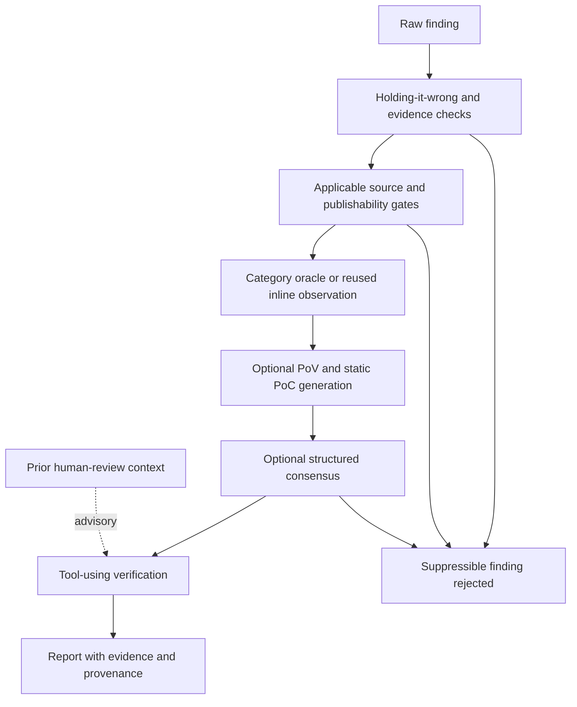

The agentic scanner applies triage between finding generation and its verifier.
This is not one mandatory eleven-step chain shared by every command: gates
depend on feature settings, source availability, category, runtime and routing.
Some make network requests or model calls. A gate's `accepted` label is not a
universal reproduction or disclosure verdict.

> **2026-04-11 ablation results.** The stack strictly beats the no-triage baseline on XBOW black-box, is a Pareto tradeoff on white-box (2 flags at limit=50 for 63% fewer findings), and is a no-op on npm-bench. Layer 11 (EGATS) is the one broken layer and is opt-in only ([0#116](https://github.com/0sec-labs/0/issues/116)). Numbers: [FP Reduction Moat](/research/fp-reduction-moat/); narrative: [2026-04-11 ablation](/research/2026-04-11-ablation/).

:::caution[Manual triage command availability]
The pipeline below is separate from the manual `0 triage` command.
Current root routing can reject that command before showing its help.
See [the routing diagnostic](/troubleshooting/#triage-command-reports-an-ambiguous-target)
before using the CLI memory examples.
:::

## Pipeline overview



The numbered sections below are a capability inventory, not execution order.
Modules live under `packages/core/src/triage/`; the agentic-scan wiring is in
`packages/core/src/agentic-scanner.ts`. EGATS is discovery orchestration, not a
final triage stage. The feature extractor is telemetry/input to gates, not a
proof step.

**Suppression is guarded.** Heuristic rejection paths consult
`isDisclosureWorthy`: protected high-impact/high-severity findings can be held
for further verification instead of dropped. That protection is not confirmation.
An error, unknown result or missing execution record must not be read as proof
that the system is safe.

## 1. Holding-it-wrong filter

`triage/holding-it-wrong.ts` detects documented sink behavior mistaken for a
vulnerability, such as treating a file-writing API as arbitrary file write.
Enforcement defaults on but `ZERO_FEATURE_HOLDING_IT_WRONG=0` disables it.
Suppressible matches become `info` / `false-positive` and skip later verification;
protected findings continue with an explanatory note. Feature extraction still
runs for telemetry even when enforcement is off.

## 2. 45-feature extractor

`triage/feature-extractor.ts` builds a 45-element numeric vector from response,
payload, evidence and category signals. The agentic scanner records it as
`triage_features`; the default-on evidence gate can suppress findings with
`evidence_completeness <= 0.5`, subject to the same protection against heuristic
auto-suppression. Disable enforcement with `ZERO_FEATURE_EVIDENCE_GATE=0`.
The ~77% recall / 16% FPR figure is a historical feature-extractor measurement,
not current-target accuracy. See [Feature Extractor](/research/feature-extractor/)
and [Triage Dataset](/research/triage-dataset/).

## 3. Per-class oracles

`triage/oracles.ts` dispatches category-specific checks by default on this path,
unless routing excludes them. A successful inline check can be reused rather
than rerun. Unsupported categories fall through; missing tools, auth or reachable
callback infrastructure can prevent a useful result.

| Category | Oracle | Proof |
|----------|--------|-------|
| SQLi | `verifySqli` | At least two of boolean response-length difference, timing delta and SQL error signatures |
| Reflected XSS | `verifyReflectedXss` | Playwright captures the unique token in a dialog; HTML reflection alone is not confirmation |
| SSRF | `verifySsrf` | Nonce-matched request to a temporary local collector; the target must be able to reach it |
| RCE | `verifyRce` | Probe command output observed in the response |
| Path traversal | `verifyPathTraversal` | Linux `/etc/passwd` signature from traversal probes; no Windows equivalent in this oracle |
| IDOR-like information disclosure | `verifyIdor` | Numeric-ID mutation returns distinct nonempty 200 responses; does **not** establish ownership across identities |

Dispatch uses `verifyOracleByCategory(finding, target)`. Its `verified` bit is
category-specific: IDOR's response-difference heuristic is weaker than a browser
execution or callback capture. The scanner may stamp accepted/confidence state;
inspect the oracle evidence rather than treating that stamp as uniform proof.
Known-category non-confirmation can downgrade severity to `low`; thrown errors
are recorded and do not abort the scan. Test authorization boundaries with known
identities before disclosing IDOR.

## 4. Reachability gate

`triage/reachability.ts` — `ZERO_FEATURE_REACHABILITY_GATE=1`. With source
available, a conservative pattern pass inspects paths, entry points and imports.
High-confidence unreachable findings can be suppressed subject to the disclosure
guard. This is not an exhaustive interprocedural proof of reachability.

Today it's a zero-dependency grep/pattern pass and deliberately conservative: when it can't make a confident call it returns `reachable: true` with low confidence so later stages still run. A tree-sitter interprocedural upgrade is planned.

<span id="5-multi-modal-agreement-foxguard--0"></span>
## 5. Multi-modal agreement (foxguard × 0)

`triage/multi-modal.ts` — `ZERO_FEATURE_MULTIMODAL=1`. When both source and the [foxguard](https://github.com/0sec-labs/foxguard) binary are present, 0 runs foxguard on the same code and cross-checks each finding against its SARIF:

- **Both fire** → prioritize verification; only sufficiently strong agreement
  and evidence completeness take the fused auto-accept branch.
- **Only 0 fires** → not refutation by itself. Low agreement confidence **and**
  incomplete evidence can trigger guarded suppression.
- **Missing tool, scan failure or uncovered file** → no independent corroboration.

Even a fused auto-accept label is a triage decision, not a fresh exploit replay.

```bash
env ZERO_FEATURE_MULTIMODAL=1 \
  0 scan --target https://example.com --scope ./scope.json --repo ./source
```

## 6. PoV generation gate

`triage/pov-gate.ts` — `ZERO_FEATURE_POV_GATE=1`. The agentic path requires a
usable runtime, a finding not already accepted, and routing permission. It uses
category-specific oracles (reusing an upstream result when available) or a
bounded PoC-generation path.

`hasPov: true` attaches evidence and boosts confidence. A conclusive negative can
downgrade to `info`; **inconclusive** results such as unavailable browser/OAST
infrastructure are annotated without treating the missing proof as a false
positive. Generation of a script is not itself proof that it executed.

## 7. Structured 4-step verify pipeline

`triage/structured-verify.ts` assesses four questions:

1. Reachability.
2. Payload validity.
3. Impact.
4. Exploit confirmation.

Despite the final step's name, each step is a model call with **no tools**.
All steps must return a passing JSON verdict; failure or malformed output
short-circuits to `rejected`. This is evidence assessment, not independent
runtime reproduction. The agentic scanner does not run a standalone four-step
pass by default; it invokes this module for optional consensus before the
tool-using verifier.

## 8. Self-consistency voting

`ZERO_FEATURE_CONSENSUS_VERIFY=1`. The agentic scanner calls `verify` with three
parallel structured passes per candidate. The SDK defaults to a single pass
unless `votes` is supplied. Early resolution can return a majority before all
calls settle; it does not guarantee cancellation of their model costs.
No per-run seed is set by this implementation. Rejected votes are subject to
the disclosure guard; errors fall through to agentic verification.

## 9. Assistant memories

`triage/memories.ts` stores false-positive context from human triage. Use `0 triage mark-fp` and `0 triage memory` to manage feedback. `ZERO_FEATURE_TRIAGE_MEMORIES` is not a current feature toggle. Memory context can inform verification; it is not independent reproduction evidence.

Scope matching is exact: `global`, inferred `package` identity, or `target`
URL/path, within the finding's category. Default ranking uses token overlap.
Opt-in Jev memory assistance reranks up to twelve shortlisted memories and falls
back to token ranking when unavailable; it never auto-rejects a finding.

On the native agentic-scan verification path, `createScanMemoryStore` is wired
when `ZERO_TRIAGE_FEEDBACK` or Jev `memory` configuration is present. Prepared
feedback is scan-local context, not imported into the global memory database.
A historical memory in another database is not automatically available to every
new run. See [advisory evaluation settings](/features/#advisory-evaluations).

```bash
# Mark a finding FP and remember why
0 triage mark-fp <finding-id> --reason "test fixture, not prod"

# Add a standalone memory
0 triage memory add --finding <id> --reason "sink is harmless helper" \
  --scope package --scope-value my-pkg

# List memories
0 triage memory list --scope target
```

## 10. Adversarial debate

**Planned — not implemented.** There is no `triage/adversarial.ts` module and no `ZERO_FEATURE_DEBATE` flag in the engine. The intent: a prosecutor (finding is real) and a defender (it's an FP) argue from fresh contexts, and a skeptical judge picks the winner — each seeing only the other's written arguments, never the research agent's chain of thought. The design follows the open-source read of Anthropic's debate paper (arXiv:2402.06782); the point is to keep the two agents' errors independent.

Its goal is partly served by the hunt **cross-family refuter**
(`stages/hunt-cross-family.ts`). Its model-family selection is specific to that
workflow and available model routes; it is not a guarantee that every scan's
finder and verifier use different model families.

## 11. EGATS — Evidence-Gated Attack Tree Search

`scan --egats` opts into beam-search discovery on the native agentic path.
It expands an explicit hypothesis tree and uses observed evidence to score
branches. It is not a downstream verification stage or part of `fp-moat`.
The historical ablation found a regression on its hard-challenge slice
([0#116](https://github.com/0sec-labs/0/issues/116)); it is not a universal
performance recommendation.

## Configuration cheat-sheet

| Env var | Default | Stage |
|---------|---------|-------|
| `ZERO_FEATURE_HOLDING_IT_WRONG` | **on** | 1 |
| `ZERO_FEATURE_EVIDENCE_GATE` | **on** | 2 |
| `ZERO_FEATURE_REACHABILITY_GATE` | off | 4 |
| `ZERO_FEATURE_MULTIMODAL` | off | 5 |
| `ZERO_FEATURE_POV_GATE` | off | 6 |
| `ZERO_FEATURE_PUBLISHABILITY_GATE` | off | 6 |
| `ZERO_FEATURE_POC_GEN_STATIC` | off | 6 |
| `ZERO_FEATURE_CONSENSUS_VERIFY` | off | 8 |
| `ZERO_FEATURE_LEARNED_ROUTER` | off | router |
| `ZERO_FEATURE_DYNAMIC_TRIAGE` | off | router |

`ZERO_FEATURE_TRIAGE_MEMORIES`, `ZERO_FEATURE_DEBATE`, and
`ZERO_FEATURE_EGATS` are not current toggles. EGATS is selected by `--egats` /
`config.egats`, not an environment flag. See [Configuration](/configuration/)
for feature settings and [Features](/features/#advisory-evaluations) for the
separate Jev controls.

<span id="enabling-the-whole-moat-at-once"></span>
## Full gate preset

`fp-moat` enables the six gates listed below, not every optional feature.
Historical results vary by slice: improved XBOW black-box results, a 0–2 flag
cost on white-box, and no change on npm-bench. The reported ~60% reduction in
findings accompanied a roughly flat correct-flag count. Re-measure on your target
before choosing the preset; enabled gates can still skip missing prerequisites.

```bash
0 scan --features fp-moat --target https://example.com --scope ./scope.json
# or, for templated CI:
env ZERO_FEATURE_PRESET=fp-moat 0 scan --target https://example.com --scope ./scope.json
```

It expands to `REACHABILITY_GATE`, `MULTIMODAL`, `PUBLISHABILITY_GATE`, `POV_GATE`, `POC_GEN_STATIC`, and `CONSENSUS_VERIFY`. Membership lives in `packages/core/src/agent/feature-presets.ts` and is pinned by test.

A flag you set yourself always wins, so you can ablate one layer:

```bash
env ZERO_FEATURE_POV_GATE=0 0 scan --features fp-moat …
```

The preset deliberately omits `LEARNED_ROUTER` and `DYNAMIC_TRIAGE` — those decide which layers to *skip* per finding, so enabling them alongside the moat would suppress the layers you're trying to measure.

<span id="checking-which-layers-actually-ran"></span>
## Layer execution records

Each layer records a verdict on the finding as it runs. `findings show` renders it:

```bash
0 findings show <id>
```

```
  Triage provenance:
  FP moat NOT engaged: no opt-in moat layer ran for this finding (always-on filters only)
  Layers: 3 executed, 5 skipped, 3 unrecorded | 412ms | $0.0000
    + holding_it_wrong   executed(pass) — no holding-it-wrong pattern matched
    + evidence_gate      executed(pass) — evidence_completeness=0.83 > 0.5
    - reachability       skipped(skip) — ZERO_FEATURE_REACHABILITY_GATE=0
    …
```


- Verdicts stored on each finding determine the displayed provenance. Changing shell flags leaves historical results unchanged.
- `skipped` ≠ `unrecorded`. `skipped` means the layer recorded that it stood down (with the flag or missing precondition named); `unrecorded` means no verdict exists at all.
- `structured_verify`, `consensus`, and `kernel_oracle` are currently listed in
  `UNINSTRUMENTED_LAYERS`: they do not emit `LayerVerdict` records. Separate
  events (such as `consensus_verify`) may exist, but this provenance summary
  cannot infer execution from them. They are not silently counted as skipped.

### Duplicate assessment is separate

Optional semantic dedupe runs in report post-processing and retains original
evidence with additive canonical/cluster mappings. Jev `dedupe` enables a bounded
fast path for exact-location/category pairs only: same location, defect and fix
must each score at least `0.98`, and insufficient evidence at most `0.02`.
Competing anchors are ambiguous. Remaining pairs use the existing generative
dedupe path. Neither grouping nor incremental ranking is a vulnerability
verification or an ecosystem novelty receipt.

## Further reading

- [Agent Loop](/agent-loop/) — how the research agent drives `bash`
- [Blind Verification](/blind-verification/) — how step 7 isolates the verify agent from the research agent's reasoning
- [Research: Finding Triage ML](/research/finding-triage-ml/) — the longer synthesis behind this pipeline